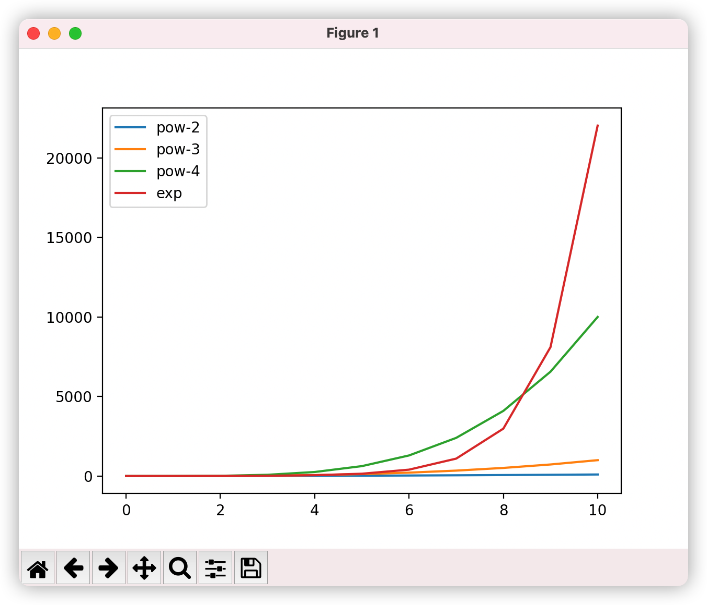
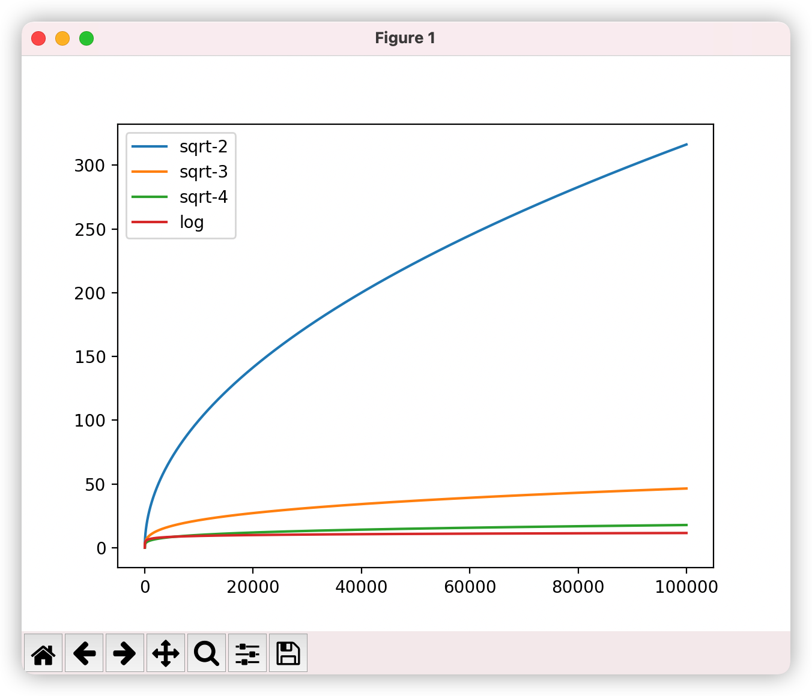
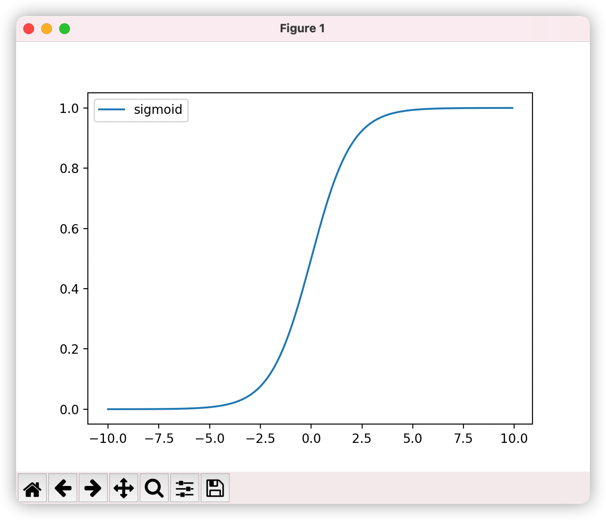

# 几个常见的函数曲线

## 指数和幂

代码如下：

```python
import matplotlib.pyplot as plt
import numpy as np

x = list(range(11))

# 2次方
y_2 = [pow(item, 2) for item in x]
plt.plot(x, y_2, label="pow-2")

# 3次方
y_3 = [pow(item, 3) for item in x]
plt.plot(x, y_3, label="pow-3")

# 4次方
y_4 = [pow(item, 4) for item in x]
plt.plot(x, y_4, label="pow-4")

# 指数幂
z = [np.exp(item) for item in x]
z = plt.plot(x, z, label="exp")

plt.legend()
plt.show()
```

图像如下：




## 对数和开方

代码如下：

```python
import matplotlib.pyplot as plt
import numpy as np

x = list(range(100000))

# 开2次方根
y_2 = [pow(item, 1/2) for item in x]
plt.plot(x, y_2, label="sqrt-2")

# 开3次方根
y_3 = [pow(item, 1/3) for item in x]
plt.plot(x, y_3, label="sqrt-3")

# 开4次方根
y_4 = [pow(item, 1/4) for item in x]
plt.plot(x, y_4, label="sqrt-4")

# 取对数
z = [np.log(item) if item >= 1 else 0 for item in x]
z = plt.plot(x, z, label="log")

plt.legend()
plt.show()
```

图像如下：




## Sigmoid

代码如下：

```python
import matplotlib.pyplot as plt
import numpy as np

def sigmoid(x):
    sig = 1 / (1 + np.exp(-x))
    return sig

x = np.arange(-10, 10, step=0.1)

z = [sigmoid(item) for item in x]
z = plt.plot(x, z, label="sigmoid")

plt.legend()
plt.show()
```

图像如下：



