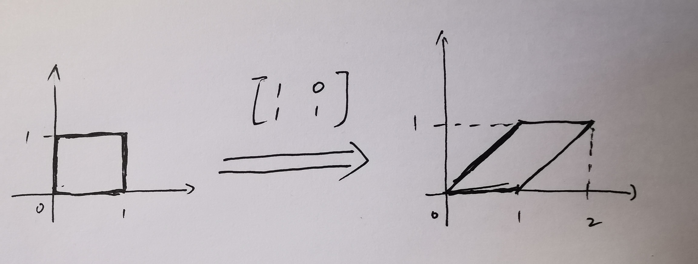

# Jacobi矩阵

## 1、Jocabi矩阵

假设 $F : R_n \rightarrow R_m$ 是一个从 $n$ 维欧氏空间映射到 $m$ 维欧氏空间的函数。这个函数由 $m$ 个实函数组成：

$$
\begin{equation}
\begin{cases}
   y_1 = f_1(x_1, x_2, ..., x_n) \\
   y_2 = f_2(x_1, x_2, ..., x_n) \\
   ... \\
   y_m = f_m(x_1, x_2, ..., x_n) \\
\end{cases}
\end{equation}
$$

这些实函数的偏导数可以组成一个 $m*n$ 的矩阵，这个矩阵就是Jocabi矩阵：

$$
\begin{equation}
J_F(x_1, x_2, ..., x_n) = \begin{bmatrix}
\frac{\partial f_1}{\partial x_1} & \frac{\partial f_1}{\partial x_2} & ... & \frac{\partial f_1}{\partial x_n} \\
   \frac{\partial f_2}{\partial x_1} & \frac{\partial f_2}{\partial x_2} & ... & \frac{\partial f_2}{\partial x_n} \\
   ... \\
   \frac{\partial f_m}{\partial x_1} & \frac{\partial f_m}{\partial x_2} & ... & \frac{\partial f_m}{\partial x_n} \\
\end{bmatrix}
\end{equation}
$$

在向量分析中，Jacobi矩阵是一阶偏导数以一定的方式排列成的矩阵；

当 $m$ 等于 $n$ 时，Jacoba矩阵就变成了一个方阵，该方阵的行列式即为Jacobi行列式。

## 2、几何理解

Jocabi矩阵的重要性在于它体现了一个可微方程与给定点的最优线性逼近；

如果 $p$ 是 $R^n$ 中的一个点，$F$ 在 $p$ 点可微，那么Jacobi矩阵 $J_F(p)$ 是在这点的导数；在此情况下 $J_F(p)$ 这个线性映射即为 $F$ 在点 $p$ 附近的最优线性逼近，也就是说当点 $x$ 足够靠近点 $p$ 时，我们有：

$$\begin{equation}F(x) \approx F(p) + J_p(p)(x-p)\end{equation}$$

关于这个`最优线性逼近`，写一下从几何方面对他的理解：

我们知道，在几何中：矩阵表示的是线性变换，比如平移、旋转、缩放。当给定的矩阵中每个元素都是常数时，该矩阵对应的线性变换就是固定的，比如下图中的变换对应的矩阵为$\begin{bmatrix}1 & 0 \\ 1 & 1\end{bmatrix}$：

上图中左侧的正方形经过变换矩阵$\begin{bmatrix}1 & 0 \\ 1 & 1\end{bmatrix}$之后得到上图右侧的平行四边形；

与上述这种变换的区别是，Jacobi矩阵中的每个元素并不都是常数，而是与 $x$ 相关的，当给定一个具体的 $x$ 之后，就可求出Jacobi矩阵中每个元素的值，此时在给定的 $x$ 的极小邻域内是一个线性变换。这就是：**Jocabi矩阵体现了一个可微方程与给定点的最优线性逼近**。

关于Jacobi矩阵在几何方便的理解可以参考bilibili上的视频：[《雅可比矩阵是什么东西》](https://www.bilibili.com/video/BV1NJ411r7ja/)；

## 3、另一个角度引出Jocabi矩阵

Jocabi矩阵是某种映射函数的导数，只不过这种映射函数比较复杂，下面从简单到复杂把几种映射函数和其导数都列一下。

### 3.1 单函数单变量

假设 $F : R \rightarrow R$ 是一个从一维欧氏空间映射到一维欧氏空间的函数，这个函数的形式为 $y=f(x)$，则其导数为：

$$\begin{equation}\frac{df}{dx}\end{equation}$$

### 3.2 单函数多变量

假设 $F : R_n \rightarrow R$ 是一个从 $n$ 维欧氏空间映射到一维欧氏空间的函数，这个函数的形式为 $y=f(x_1, x_2, ..., x_n)$，则其导数为：

$$\begin{equation}[\frac{\partial f}{\partial x_1}, \frac{\partial f}{\partial x_2}, ..., \frac{\partial f}{\partial x_n}]\end{equation}$$

> PS：这里没有考虑应该是行向量还是列向量；

### 3.3 多函数多变量

假设 $F : R_n \rightarrow R_m$ 是一个从 $n$ 维欧氏空间映射到 $m$ 维欧氏空间的函数，这些个函数的形式为

$$
\begin{equation}
\begin{cases}
   y_1 = f_1(x_1, x_2, ..., x_n) \\
   y_2 = f_2(x_1, x_2, ..., x_n) \\
   ... \\
   y_m = f_m(x_1, x_2, ..., x_n) \\
\end{cases}
\end{equation}
$$

则其导数为：

$$
\begin{equation}
\begin{bmatrix}
\frac{\partial f_1}{\partial x_1} & \frac{\partial f_1}{\partial x_2} & ... & \frac{\partial f_1}{\partial x_n} \\
   \frac{\partial f_2}{\partial x_1} & \frac{\partial f_2}{\partial x_2} & ... & \frac{\partial f_2}{\partial x_n} \\
   ... \\
   \frac{\partial f_m}{\partial x_1} & \frac{\partial f_m}{\partial x_2} & ... & \frac{\partial f_m}{\partial x_n} \\
\end{bmatrix}
\end{equation}
$$

也就是Jocabi矩阵。

## Reference

* [雅可比矩阵（整理）: https://www.cnblogs.com/rswss/p/11440144.html](https://www.cnblogs.com/rswss/p/11440144.html)
* [如何理解雅克比矩阵: https://www.zhihu.com/question/22586361](https://www.zhihu.com/question/22586361)
* [雅可比矩阵是什么东西: https://www.bilibili.com/video/BV1NJ411r7ja/](https://www.bilibili.com/video/BV1NJ411r7ja/)
