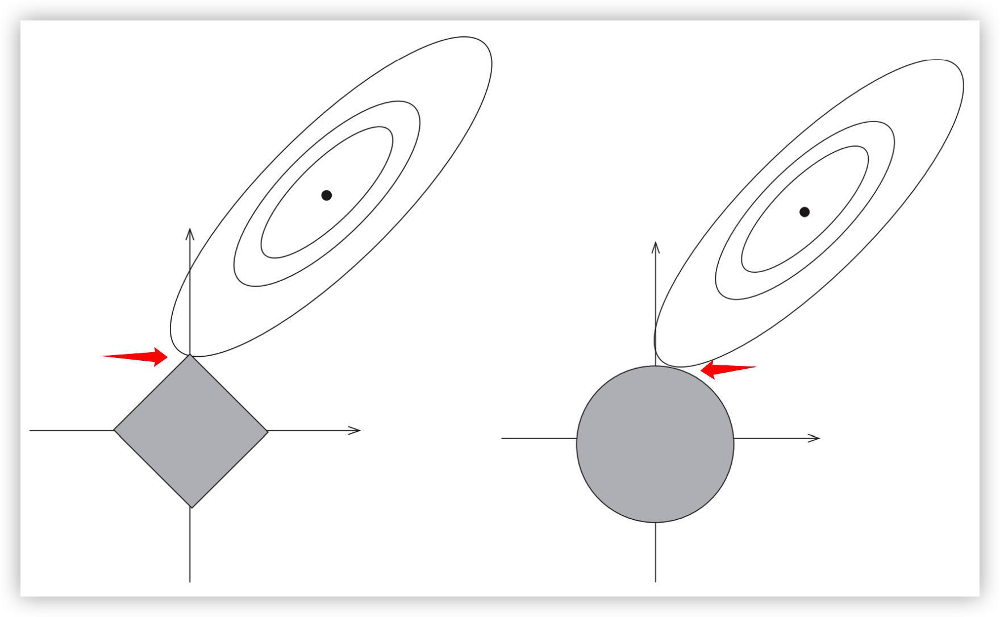

# 正则化

> 说明：在该篇文章中所有的推导都忽略了偏置项 bias；

## 1、L2正则

正则化项为 $\Omega (\theta) = \frac{1}{2}||\theta||^2_2$，系数 $\frac{1}{2}$ 是为了求导时得到的系数为 $1$；

$L_2$ 正则化能够使参数 $\theta$ 的方差更接近0；

目标函数：

$$\begin{equation}J(\theta)=L(\theta)+ \lambda \Omega(\theta) = L(\theta) + \frac{1}{2}\lambda ||\theta||^2_2\end{equation}$$

梯度为：

$$\begin{equation}\nabla_{\theta} J(\theta) = \nabla_{\theta} L(\theta) + \lambda \theta\end{equation}$$

梯度下降过程如下，这里的 $\gamma$ 为学习率：

$$\begin{equation}\theta \leftarrow \theta - \gamma (\nabla_{\theta} L(\theta) + \lambda \theta)\end{equation}$$

对上述梯度下降过程整理一下得：

$$\begin{equation}\theta \leftarrow (1-\gamma \lambda)\theta - \gamma \nabla_{\theta} L(\theta)\end{equation}$$

在不使用 $L_2$ 正则化的情况下，梯度下降的公式为：

$$\begin{equation}\theta \leftarrow \theta - \gamma \nabla_{\theta} L(\theta)\end{equation}$$

对比公式$(4)$和公式$(5)$可知，$L_2$正则化对梯度更新的影响是：每一步执行更新前，会对权重向量乘以一个常数因子来收缩权重向量，使参数 $\theta$ 的方差更接近0，因此$L_2$也被称为**权重衰减**；

## 2、L1正则

正则化项为 $\Omega(\theta) = ||\theta||_1 = \sum_{i=1}^d |\theta_i|$，即各个参数的绝对值之和；

目标函数：

$$\begin{equation}J(\theta)=L(\theta)+\Omega(\theta)=L(\theta)+\lambda ||\theta||_1\end{equation}$$

梯度：

$$\begin{equation}\nabla_{\theta} J(\theta)=\nabla_{\theta} L(\theta) + \lambda \cdot \text{sign}(\theta)\end{equation}$$

其中 $\text{sign}(\cdot)$ 表示取自变量的符号；

梯度下降过程如下，这里的 $\gamma$ 为学习率：

$$\begin{equation}\theta \leftarrow \theta - \gamma \cdot(\nabla_{\theta} L(\theta) + \lambda \cdot \text{sign}(\theta))\end{equation}$$

对上述梯度下降过程整理一下得：

$$\begin{equation}\theta \leftarrow (\theta - \gamma \cdot \lambda \cdot \text{sign}(\theta)) - \gamma \cdot \nabla_{\theta}L(\theta)\end{equation}$$

在不使用 $L_1$ 正则化的情况下，梯度下降的公式为：

$$\begin{equation}\theta \leftarrow \theta - \gamma \nabla_{\theta} L(\theta)\end{equation}$$

对比公式$(9)$和公式$(10)$可知:

* 上面讨论过 $L_2$ 正则化对梯度更新的影响是：给每个权重值乘上一个常数因子，线性的缩放每个权重值；

* $L_1$正则化对梯度更新的影响是：给每个权重值减去一个与 $\text{sign}(\theta_i)$ 同符号的常数因子；

> 特别说明：对于带有 $L_1$ 正则的目标函数，由于其不是处处可导，所以一般不使用梯度下降法进行求解，这里只是和 $L_2$ 正则做一个类似的讨论。在本文的最后一部分会介绍坐标轴下降法，是更常用的用于求解带有 $L_1$ 正则的目标函数的方法；

## 3、Lasso回归与岭回归

### 3.1 Lasso回归与岭回归的定义

在线性回归的目标函数上添加上 $L_1$ 或 $L_2$ 正则化项，则可以得到Lasso回归和岭回归，其公式如下：

Lasso回归：

$$\begin{equation}J(\theta)=L(\theta)+ \lambda ||\theta||_1 =\frac{1}{2}\sum_{i=1}^n (h_{\theta}(x_i) - y_i)^2 + \lambda ||\theta||_1\end{equation}$$

岭回归：

$$\begin{equation}J(\theta)=L(\theta)+ \lambda \cdot \frac{1}{2} ||\theta||_2^2= \frac{1}{2}\sum_{i=1}^n (h_{\theta}(x_i) - y_i)^2 + \lambda \cdot \frac{1}{2} ||\theta||_2^2\end{equation}$$

### 3.2 L1为何能做特征筛选

关于 $L_1$ 和 $L_2$ 有一个常见的结论是：

* $L_1$：能够使权重值中的一些特征趋于0，因此可以用来做特征筛选；
* $L_2$：能够使权重值中的所有特征的方差趋于0；

这一部分讨论一下为什么 $L_1$ 能够使权重值中的一些特征趋于0；

Lasso回归与岭回归的目标函数都是拉格朗日格式，其中 $\lambda$ 是KKT乘子，所以可以将其改写为带有约束条件的最优化问题。

Lasso回归：

$$
\begin{equation}
\begin{split}
& \min_{\theta} \frac{1}{2} \sum_{i=1}^n (h_{\theta}(x_i) - y_i)^2 \\
& s.t. \quad ||\theta||_1 \leqslant t
\end{split}
\end{equation}
$$

岭回归：

$$
\begin{equation}
\begin{split}
& \min_{\theta} \frac{1}{2} \sum_{i=1}^n (h_{\theta}(x_i) - y_i)^2 \\
& s.t. \quad \frac{1}{2}||\theta||_2^2 \leqslant t
\end{split}
\end{equation}
$$

其中 $t$ 表示正则化的力度，$t$ 越小，正则化力度越大，也对应原目标函数中的 $\lambda$ 越大。

下面通过画图来理解。



如上图所示，Lasso回归（即公式$(13)$）的约束条件为左图中灰色的方形区域；岭回归（即公式$(14)$）的约束条件为右图中灰色的圆形区域；两图中右上方的椭圆线为损失函数 $L(\theta)$ 的等高线，损失函数 $L(\theta)$ 在椭圆的中心处取得最小值。

既要满足方形/圆形的灰色区域的约束，又要尽量取最小值，可知上述两个带约束的最优化问题的最优解都在：等高线与约束区域边界的交点处；即两个红色箭头所指的交点处。

由于 $L_1$ 正则对应的约束区域是方形的，椭圆形的等高线与方形区域边界的交点更容易出现在该方形区域的顶点上，也就是坐标轴上。而这些坐标轴上的点仅当前坐标轴对应的维度非0，其他维度取值都为0。所以相比于 $L_2$，$L_1$更适合做特征选择。

## 4、带有L2正则的目标函数的求解

### 4.1 公式

由于 $L_2$ 正则本身连续且处处可微，所以直接使用梯度下降法即可进行求解。

在第一部分的讨论中，已经求得了带有 $L_2$ 正则的目标函数的梯度下降过程公式：

$$\begin{equation}\theta \leftarrow \theta - \gamma \cdot (\nabla_{\theta} L(\theta) + \lambda \theta)\end{equation}$$

这个公式很简单，下面看一下在Pytorch中是如何实现$L_2$正则的功能的。

### 4.1 Pytorch中L2的实现

#### 4.1.1 调用方式

在 pytorch 中L2正则是通过 weight decay 在优化器中实现的，只需要在初始化优化器时指定哪些参数需要L2正则，哪些参数不需要L2正则即可。如下所示：

```python
weight_decay = 0.01
learning_rate = 0.00005

no_decay = ["bias", "LayerNorm.weight"]
optimizer_grouped_parameters = [
    {
        "params": [p for n, p in model.named_parameters() if not any(nd in n for nd in no_decay)],
        "weight_decay": weight_decay,
    },
    {
        "params": [p for n, p in model.named_parameters() if any(nd in n for nd in no_decay)],
        "weight_decay": 0.0,
    },
]
optimizer = AdamW(optimizer_grouped_parameters, lr=learning_rate)
```

#### 4.1.2 源码

以最简单的SGD优化器来看一下L2正则在优化器中具体是如何实现的：

```python
class SGD(Optimizer):

    def step(self,):
        for group in self.param_groups:
            lr = group["lr"]  # 学习率
            weight_decay = group["weight_decay"]  # weight decay

            for p in group["params"]:
                if p.grad is None:  # 如果当前参数梯度为None，则不需要更新
                    continue
                d_p = p.grad  # 梯度

                if weight_decay != 0:
                    # 在原梯度的基础上加上 (weight_decay * 权重)
                    d_p.add_(weight_decay, p.data)  
                
                # 将（梯度 * -学习率）更新到权重参数上；当 weight_decay 不等
                # 于0时，这里的梯度 d_p 已经加上了(weight_decay * 权重)
                p.data.add_(-lr, d_p)  
```

再放一下梯度下降过程的公式，对着公式来看代码：

$$\begin{equation}\theta \leftarrow \theta - \gamma \cdot (\nabla_{\theta} L(\theta) + \lambda \cdot \theta)\end{equation}$$

* 公式中的 $\lambda$ 对应代码中的 `weight_decay`；

* 公式中的 $\gamma$ 对应代码中的 `lr`；

代码中的注释很详细，不再赘述。

## 5、带有L1正则的目标函数的求解

下面使用坐标轴下降法对带有 $L_1$ 正则的目标函数进行求解；

梯度下降法是沿着梯度的负方向下降；坐标轴下降法是沿着坐标轴方向下降；二者的相似点是都是迭代法；

### 5.1 优化问题

先在这里列一下模型和目标函数，然后描述如何使用坐标轴下降法对该优化问题进行求解；

模型为：$y = h_{\theta(x)}$，其中权重参数 $\theta$ 的维度为 $d$，即 $\theta = (\theta_1, \theta_2, ..., \theta_d)$

损失函数选取MSE，则目标函数为：

$$J(\theta) = \frac{1}{2}\sum_{i=1}^n (y_i - \sum_{j=1}^d x_{ij} \cdot \theta_j)^2 + \lambda \sum_{j=1}^d |\theta_j|$$

### 5.2 坐标轴下降法

坐标轴下降算法过程分为三个步骤：

1. 对权重进行随机初始化；随机初始化的权重记作 $\theta^{(0)}=(\theta_1^{(0)}, \theta_2^{(0)}, ..., \theta_d^{(0)})$；这里右上角的角标 $\cdot^{(0)}$ 表示当前是第0轮迭代，右下角的角标表示的是权重参数的第几个维度；

2. 进行第 $k$ 轮迭代；

    第 $k$ 轮迭代前：$\theta^{(k-1)} = (\theta_1^{(k-1)}, \theta_2^{(k-1)}, ..., \theta_d^{(k-1)})$

    第 $k$ 轮迭代后：$\theta^{(k)} = (\theta_1^{(k)}, \theta_2^{(k)}, ..., \theta_d^{(k)})$

    在第 $k$ 轮迭代中，会从坐标轴1逐步迭代到坐标轴 $d$（即迭代权重参数的每个维度），对 $\theta^{(k-1)}$ 的 $d$ 个维度逐步迭代的公式如下：

    $$\begin{equation}\begin{split}
    & \theta_1^{(k)} = \arg \min_{\theta_1} J(\theta_1, \theta_2^{(k-1)}, ..., \theta_d^{(k-1)}) \\
    & \theta_2^{(k)} = \arg \min_{\theta_2} J(\theta_1^{(k)}, \theta_2, \theta_3^{(k-1)}, ..., \theta_d^{(k-1)}) \\
    & ... \\
    & \theta_d^{(k)} = \arg \min_{\theta_d} J(\theta_1^{(k)}, \theta_2^{(k)}, ..., \theta_{d-1}^{(k)}, \theta_d)
    \end{split}\end{equation}$$

    注意在上述公式（17）中，第一个式子的等号右边只有 $\theta_1$ 为变量，其它都是常量；第二个式子的等号右边只有 $\theta_2$ 为变量，其它都是常量；最后一个式子的等号右边只有 $\theta_d$ 是变量，其他都是常量；

    公式（17）中的 $d$ 个式子可以合并用如下一个式子进行表示：

    $$\theta_l^{(k)} = \arg \min_{\theta_l} J(\theta_1^{(k)}, \theta_2^{(k)}, ..., \theta_{l-1}^{(k)}, \theta_{l}, \theta_{l+1}^{(k-1)}, ..., \theta_d^{(k-1)}), \qquad  l \in \{1, 2, ..., d\}$$

    在该式的等号右边只有 $\theta_l$ 是变量，其它的像 $\theta_1^{(k)}$、$\theta_2^{(k)}$、...、$\theta_{l-1}^{(k)}$、$\theta_{l+1}^{(k-1)}$、...、$\theta_d^{(k-1)}$都是常量；

    我们现在先假设该式是容易求解的，先看完坐标轴下降法的整个算法流程；至于该式的具体解法在下一小节说明；

3. 终止条件：第 $k$ 次迭代完成后，检查 $\theta^{(k)}$ 与 $\theta^{(k-1)}$ 在各个维度上的变化情况，如果各个维度的变化都足够小，那么终止迭代，$\theta^{(k)}$ 即为最终结果；否则重复第2步，继续迭代；

以上就是坐标轴下降法：先随机初始化权重矩阵；然后对每个维度的参数进行优化，在优化第 $l$ 个维度时，将其它维度视为常量；待每个维度都优化一轮之后，检查是否可以终止：若可以终止，则优化结束，否则重复上述优化步骤；

### 5.3 求解 $\arg \min_{\theta_l} J$

在上一小节遗留了一个问题，就是如何求解下式，在这一小节对该式进行求解。

$$\begin{equation}\theta_l^{(k)} = \arg \min_{\theta_l} J(\theta_1^{(k)}, \theta_2^{(k)}, ..., \theta_{l-1}^{(k)}, \theta_{l}, \theta_{l+1}^{(k-1)}, ..., \theta_d^{(k-1)})\end{equation}$$

#### 5.3.1 问题描述

再次描述一下整个问题，如下：

模型为：$y = h_{\theta(x)}$，其中权重参数 $\theta$ 的维度为 $d$，即 $\theta = (\theta_1, \theta_2, ..., \theta_d)$

目标函数为：

$$\begin{equation}J(\theta) = \frac{1}{2}\sum_{i=1}^n (y_i - \sum_{j=1}^d x_{ij} \cdot \theta_j)^2 + \lambda \sum_{j=1}^d |\theta_j|\end{equation}$$

求解：

$$\begin{equation}\theta_l^{(k)} = \arg \min_{\theta_l} J(\theta_1^{(k)}, \theta_2^{(k)}, ..., \theta_{l-1}^{(k)}, \theta_{l}, \theta_{l+1}^{(k-1)}, ..., \theta_d^{(k-1)})\end{equation}$$

其中 $n$ 表示数据集中的样本数量；$d$ 表示每条样本的维度，同时也是权重参数 $\theta$ 的维度；$\lambda$ 是超参数；

求解上式，我们采用导数等于 $0$ 的方式。所以下面将分为两部分说明：一部分是求导；另一部分是令导数等于 $0$ 求解出 $\theta_l$；

#### 5.3.2 求导

$$\begin{equation}\begin{split}
& \frac{\partial}{\partial \theta_l} J(\theta_1^{(k)}, \theta_2^{(k)}, ..., \theta_{l-1}^{(k)}, \theta_{l}, \theta_{l+1}^{(k-1)}, ..., \theta_d^{(k-1)}) \\
= & \sum_{i=1}^n (y_i - \sum_{j=1}^d x_{ij} \cdot \theta_j) \cdot (-x_{il}) + \lambda \frac{\partial}{\partial \theta_l} |\theta_l| \\
= & \sum_{i=1}^n (y_i - \sum_{j \neq l}^d x_{ij} \cdot \theta_j - x_{il} \cdot \theta_l) \cdot (-x_{il}) + \lambda \frac{\partial}{\partial \theta_l} |\theta_l| \\
= & - \sum_{i=1}^n (y_i - \sum_{j \neq l}^d x_{ij} \cdot \theta_j) \cdot x_{il} + \sum_{i=1}^n x_{il}^2 \cdot \theta_l + \lambda \frac{\partial}{\partial \theta_l} |\theta_l|
\end{split}\end{equation}$$

在上述推导过程中，后两步变换过程主要目的是将变量提出来，在上式中只有 $\theta_l$ 是变量，其他的都是常量。

为了后面书写方便，记：

$$\begin{equation}\begin{split}
& r_l = \sum_{i=1}^n (y_i - \sum_{j\neq l}^d x_{ij} \cdot \theta_j) \cdot x_{il} \\
& z_l = \sum_{i=1}^n x_{il}^2
\end{split}\end{equation}$$

再次强调，由于 $x_{ij}$、$y_i$、$\theta_j(j \neq l)$ 都是常量，所以这里的 $r_l$ 和 $z_l$ 也都是常量；于是公式（21）就变成了如下形式：

$$\begin{equation}\frac{\partial J(...)}{\partial \theta_l} = -r_l + z_l \cdot \theta_l + \lambda \frac{\partial}{\partial \theta_l} |\theta_l|\end{equation}$$

> 这里涉及到了对绝对值函数进行求导，涉及次梯度的概念。在此，只放一个结论，不过多讨论。对于函数 $f(x)=|x|$，其导数为：

> $$f^{\prime}(x) = \begin{cases}1, &x > 0 \\
[-1, 1], &x = 0 \\
-1, &x < 0
\end{cases}$$

根据绝对值函数导数的结论，对公式（23）继续求导可得：

$$\begin{equation}
\frac{\partial J(...)}{\partial \theta_l} =\begin{cases}
-r_l + z_l \theta_l + \lambda, &\theta_l > 0 \\
[-r_l + z_l \theta_l - \lambda, -r_l + z_l \theta_l + \lambda], &\theta_l = 0 \\
-r_l + z_l \theta_l - \lambda, &\theta_l < 0 
\end{cases}\end{equation}$$

至此，求导完成，下面令导数等于0，求解 $\theta_l$；

#### 5.3.3 令导数等于0求解 $\theta_l$

由于上一步中最后求得的导数为分段函数，这里也分段进行求解；

* 当 $\theta_l > 0$ 时：

    有 $-r_l + z_l \theta_l + \lambda = 0$，解得 $\theta_l = \frac{r_l - \lambda}{z_l}$

    由于 $\theta_l=\frac{r_l - \lambda}{z_l}>0$ 且 $z_l = \sum_{i=1}^n x_{il}^2 \geqslant 0$，可推导出 $r_l > \lambda$

* 当 $\theta_l < 0$ 时：

    有 $-r_l + z_l \theta_l - \lambda = 0$，解得 $\theta_l = \frac{r_l + \lambda}{z_l}$

    由于 $\theta_l=\frac{r_l + \lambda}{z_l}>0$ 且 $z_l = \sum_{i=1}^n x_{il}^2 \geqslant 0$，可推导出 $r_l < -\lambda$

* 当 $\theta_l = 0$ 时：

    有 $0 \in [-r_l - \lambda, -r_l + \lambda]$，可推导出 $-\lambda \leqslant r_l \leqslant \lambda$

将三部分合到一起，即：

$$\begin{equation}\theta_l = \begin{cases}
\frac{r_l - \lambda}{z_l}, &r_l > \lambda \\
0, &-\lambda \leqslant r_l \leqslant \lambda \\
\frac{r_l + \lambda}{z_l}, &r_l < -\lambda
\end{cases}\end{equation}$$

至此对 $\arg \min_{\theta_l} J(\theta_1^{(k)}, \theta_2^{(k)}, ..., \theta_{l-1}^{(k)}, \theta_{l}, \theta_{l+1}^{(k-1)}, ..., \theta_d^{(k-1)})$ 的求解完成。

#### 5.3.4 伪代码实现

前面已经说过多次，$r_l$ 和 $z_l$ 都是常量，可通过数据集 $\{(x_1,y_1), (x_2, y_2), ..., (x_n, y_n)\}$ 与 除了第 $l$ 维以外的权重参数 $\theta_1^{(k)}$、$\theta_2^{(k)}$、...、$\theta_{l-1}^{(k)}$、$\theta_{l+1}^{(k-1)}$、...、$\theta_d^{(k-1)}$ 求解出来；

据此给出伪代码如下：


```
function calculate_theta_l():
    r_l = ... # 前面已解释了r_l可直接求得
    z_l = ... # 前面已解释了z_l可直接求得
    theta_l = max((r_l - lambda)/z_l, 0) + min((r_l + lambda)/z_l, 0) # 上面最后推导出来的分段函数（25）可以整合成这一行伪代码
```

## Refrence

* [正则化：http://www.huaxiaozhuan.com/深度学习/chapters/3_regularization.html](http://www.huaxiaozhuan.com/%E6%B7%B1%E5%BA%A6%E5%AD%A6%E4%B9%A0/chapters/3_regularization.html)

* [Lasso回归和岭回归：https://www.cnblogs.com/wuliytTaotao/p/10837533.html](https://www.cnblogs.com/wuliytTaotao/p/10837533.html)

* [Lasso回归算法： 坐标轴下降法与最小角回归法小结：https://www.cnblogs.com/pinard/p/6018889.html](https://www.cnblogs.com/pinard/p/6018889.html)

* [LASSO的坐标下降法求解：https://zhuanlan.zhihu.com/p/429541451](https://zhuanlan.zhihu.com/p/429541451)
